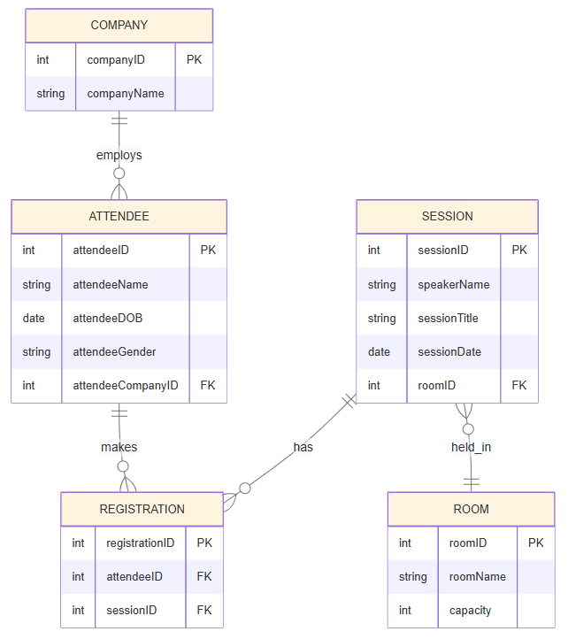
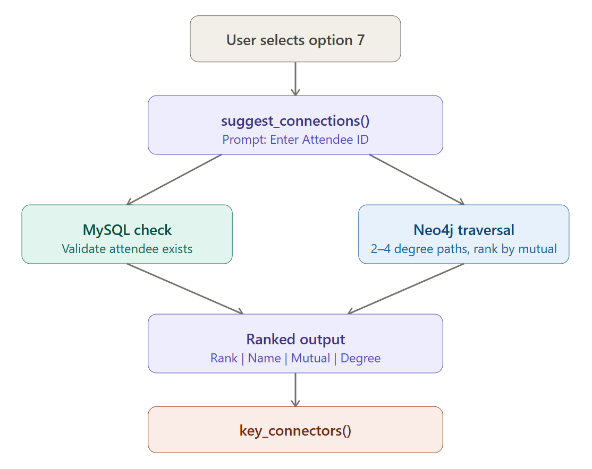

# Applied Databases Project 2026 — Conference Management System

**Author:** Mariane McGrath  
**Module:** Applied Databases — Higher Diploma in Computing in Data Analytics, ATU

---

## Overview

A conference management system built with a hybrid database approach — MySQL for structured data, Neo4j for relationship data. The system is a manager-only tool, giving event organisers full control over attendee data, session management, and networking insights.

- **MySQL** → attendees, companies, sessions, rooms, registrations
- **Neo4j** → professional connections between attendees
- **Python** → application logic, DAO pattern, menu-driven interface
---

## System Architecture


---

## Features

- View speakers and their sessions
- View attendees by company
- Add new attendees
- View an attendee's existing connections
- Add new connections between attendees
- View room details (cached per session)
- **Networking Intelligence Tool** *(Innovation Feature — see below)*
---

## Database Schema (ERD)



---

## Innovation Feature — Networking Intelligence Tool


Professional networking is one of the primary purposes of conferences. The Networking Intelligence Tool gives event organisers two powerful views of their attendee network — one focused on individuals and one on the conference as a whole.

This enables organisers to identify high-value networking opportunities and support targeted introductions between attendees.



### What it does

**1. Suggested connections (attendee-level)**

- Enter any attendee ID
- The system traverses the Neo4j graph to find second-to-fourth degree connections
- Suggestions are ranked by number of mutual connections (most relevant first)
- Results are enriched with attendee name, company, and sessions attended
- Existing direct connections are excluded — no noise, just new leads

**2. Key connectors (conference-level)**

- No input needed — a bird's-eye view of the whole network
- Ranks all attendees by their number of connections
- Identifies highly connected attendees who may act as central nodes within the network

Useful for seating plans, panel selection, breakout group design, or knowing who the natural connectors in the room are.


### Neo4j graph — full connection overview

The graph below shows all `CONNECTED_TO` relationships in the database (LIMIT 10). The results overview panel confirms 16 attendee nodes and 10 CONNECTED_TO relationships loaded successfully.

![Neo4j Browser: MATCH (a:Attendee)-[r:CONNECTED_TO]->(b:Attendee) RETURN a, r, b LIMIT 10. Results panel shows 16 Attendee nodes and 10 CONNECTED_TO relationships.](images/neo4j_graph_model.png)

### Neo4j graph — all connections (LIMIT 20)

A broader view of the attendee connection graph showing the network structure across nodes including 103, 104, 106, 111, 114, 120, 105, 113, 102, and 110.

![Neo4j Browser: MATCH (a:Attendee)-[r:CONNECTED_TO]-(b:Attendee) RETURN a, r, b LIMIT 20. Distributed network of green Attendee nodes with CONNECTED_TO edges.](images/attendee_connections.png)

### Neo4j graph — 2 to 4 degree traversal (the suggest_connections query)

This is the core query behind `suggest_connections()` in `dao.py`. Starting from attendee 106, it finds nodes reachable at 2–4 degrees while excluding existing direct connections — returning only new, relevant suggestions.

![Neo4j Browser: MATCH p = (u:Attendee {AttendeeID: 106})-[:CONNECTED_TO*2..4]-(c) WHERE NOT (u)-[:CONNECTED_TO]-(c) RETURN p. Indirect connections from 106 through nodes 111, 101, 103, 104, 120, 107, and 109 with direct connections filtered out.](images/2_to_4_degree_traversal_connections.png)

### Why Neo4j?

Relationship traversal across multiple degrees of separation is a natural use case for graph databases. Implementing the same functionality in MySQL would require significantly more complex recursive joins, whereas Neo4j handles this efficiently through native graph traversal.

---

## Usage

### Terminal interface

The system runs as a menu-driven terminal application. All options are accessed by event managers only.


---

## Data Flow — View Connected Attendees (Option 4)

Option 4 is a good example of the two-database pattern used throughout the system. MySQL handles validation and name resolution; Neo4j handles the graph traversal.


---

## Tech Stack

- Python 3.x
- MySQL (`mysql-connector-python`)
- Neo4j (`neo4j` driver)
- `python-dotenv` for environment variables

### Example `.env`

```env
DB_HOST=127.0.0.1
DB_USER=root
DB_PASSWORD=
DB_NAME=appdbproj
DB_PORT=3306

NEO4J_URI=your_neo4j_uri
NEO4J_USER=your_neo4j_username
NEO4J_PASSWORD=your_neo4j_password
```
---

## Installation

Install required Python packages:

```bash
pip install neo4j mysql-connector-python python-dotenv
```

This project requires:
- Python 3.x
- MySQL Server
- Neo4j Database

**Note:** Neo4j database is provided as .cypher format to ensure compatibility with current Neo4j versions 
— drag and drop into Neo4j Browser to import.

---

## Setup

1. Import `appdbproj.sql` into MySQL
2. Import `appdbprojNeo4j.cypher` into Neo4j
3. Configure the `.env` file using `.env.example`
4. Ensure both MySQL and Neo4j services are running before launching the application

This application depends on both databases:

- **MySQL** stores structured conference data
- **Neo4j** stores attendee relationship data used for networking analysis

Neo4j Aura Free uses the default database name (`neo4j`).  
For compatibility with Aura, Neo4j sessions in the project use:

```python
with driver.session() as session:
```
---

## Run

```bash
python main.py
```
---

## Project Structure

```text
├── main.py
├── dao.py
├── db_connection.py
├── neo4j_connection.py
├── requirements.txt
├── .env.example
├── GitLink.txt
├── innovation.pdf
├── README.md
├── appdbproj.sql
├── appdbprojNeo4j.cypher
├── images/
   ├── system_architecture.png
   ├── database_schema.png
   ├── option7_networking.png
   ├── neo4j_graph_model.png
   ├── attendee_connections.png
   ├── attendee_connections_1to4.png
   ├── 2_to_4_degree_traversal_connections.png
   ├── ui_mockup.png
   └── data_flow_connections.png
```
---

## Design Decisions

- **DAO pattern** keeps database logic cleanly separated from application logic.
- **Hybrid database approach** — relational for structure, graph for relationships.
- **Room data is cached** on first load and reused for the session (as per spec).
- **Neo4j MERGE** is used when creating attendee connections to prevent duplicate relationships within the graph.
- **Manager-only access** — the system is designed for event organisers, not attendees.
---

### Testing

All menu options were tested manually and scripts were created to test connection as well as to simulate user interaction with the 
application using Python.

All automated tests passed successfully after final integration testing.


---

## Notes

- Designed and tested primarily in GitHub Codespaces and the ATU development environment
- MySQL and Neo4j must both be running before launching the application or executing the test suite
- The Neo4j export initially produced compatibility issues during JSON import, therefore the graph database was exported/imported using Cypher format for improved reliability during testing
- The networking feature requires a minimum level of graph connectivity to produce meaningful recommendation results
